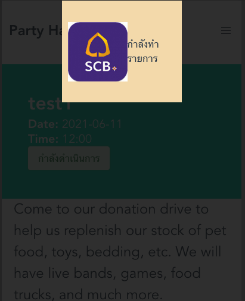

# PartyHaan App


## Installation

```bash
docker-compose up
```

## PartyHaan High Level Architecture


<hr/>
<br>

### Frontend Feature
* <strong>Login/Register</strong>


<hr/>
<br>

* <strong>Create Party</strong>


<hr/>
<br>

* <strong>Party Listing</strong>


<hr/>
<br>

* <strong>Payment</strong>
<p> Proceed to pay after joining </p>

   

<hr/>
<br>


* <strong>Notification</strong>
<br>
<p> The system will inform all users after you have paid. </p>
<br>

    
